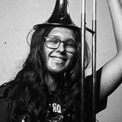
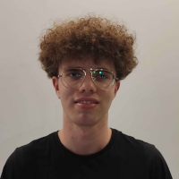
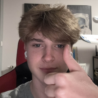
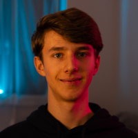
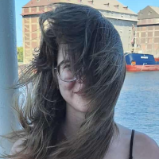

# Kim jesteśmy?

Jesteśmy grupą osób zainteresowanych technologią. Wszyscy chodzimy do V Liceum Ogólnokształcącego im. Andrzeja Struga w Gliwicach. Potrzegamy konkurs CanSat jako okazję by sprawdzić swoje umiejętności, nauczyć się czegoś nowego, a przede wszystkim - stworzyć coś fajnego! 

### Oto my:

    

        

            <h2>Jan Stolarczyk</h2>
            

                Elektronika
                Mechanika
                Outreach
            

            

                Pasjonuję się szeroko pojętymi naukami przyrodniczymi i ścisłymi, w szczególności biologią, matematyką, chemią oraz fizyką. W drużynie zajmuję się mechaniką oraz kwestiami finansowymi.
            

        

        
    

    

        
        

            <h2>Kamil Kaczyński</h2>
            

                Software i strona
                Design graficzny
                Warsztaty
                Pisanie
            

            

                Na co dzień jestem pasjonatem programowania i muzyki - tworzę swoje własne gry i utwory, oraz uczę się gry na puzonie w PSM. W naszej drużynie zarządzam softwarem, designem graficzym oraz stroną internetową. Piszę również teksty dotyczące naszego projektu.
            

        

    

    

        

            <h2>Jakub Kononowicz vel Siemionowicz</h2>
            

                Software
                Research
            

            

                Do moich zainteresowań należą: programowanie, lotnictwo wojskowe i grafika 3D. Moje mocne strony to przedmioty ścisłe, w szególności matematyka i fizyka. W wolnym czasie, poza programowaniem czy modelowaniem, lubię rozerwać się w jakiś gierkach. W drużynie zajmuje się programowaniem.
            

        

        
    

    

        
        

            <h2>Adam Lasota</h2>
            

                Social media
                Mechanika
                Operacja dronów
            

            

                Interesuje się dronami, głównie FPV, modelami RC i szeroko pojętą elektroniką. W drużynie zajmuje się mechaniką, elektroniką i outreachem.
            

        

    

    

        

            <h2>Leon Sułkowski</h2>
            

                Dokumentacja działań
                Research
            

            

                Interesuję się różnymi dziedzinami nauk ścisłych, a w szczególności krystalografią i powiązaną z nią fizyką i chemią. W drużynie zajmuję się promocją, a także rozwojem koncepcji i pomysłów projektowych.
            

        

        
    

    

        
        

            <h2>Oliwia Fink</h2>
            

                Dokumentacja działań
                Korekcja tekstu
            

            

                Pasjonuję się literaturą oraz historią i kulturą starożytnej Grecji. W wolnym czasie słucham muzyki, sięgam po literaturę piękną albo gram w gry komputerowe.
            

        

    

Nasza drużyna pracuje pod kierunkiem p. dr Beaty Zimnickiej, która uczy nas fizyki w V Liceum Ogólnokształcącym.
