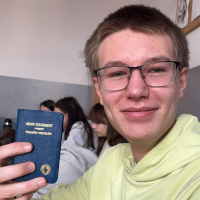

# Kim jesteśmy?

Jesteśmy grupą osób zainteresowanych technologią. Wszyscy chodzimy do V Liceum Ogólnokształcącego im. Andrzeja Struga w Gliwicach. Potrzegamy konkurs CanSat jako okazję by sprawdzić swoje umiejętności, nauczyć się czegoś nowego, a przede wszystkim - stworzyć coś fajnego! 

### Oto my:

    

        

            <h2>Jan Stolarczyk</h2>
            

                Pasjonuję się szeroko pojętymi naukami przyrodniczymi i ścisłymi, w szczególności biologią, matematyką, chemią oraz fizyką. Jestem liderem drużyny, poza tym zajmuję się mechaniką, oraz kwestiami finansowymi.
            

        

        
    

    

        
        

            <h2>Kamil Kaczyński</h2>
            

                Na co dzień jestem pasjonatem programowania i muzyki - tworzę swoje własne gry i utwory, oraz uczę się gry na puzonie w PSM. W naszej drużynie zajmuje się softwarem, designem graficzym oraz stroną internetową.
            

        

    

    

        

        <h2>Jakub Kononowicz vel Siemionowicz</h2>
        

            Do moich zainteresowań należą: programowanie, lotnictwo wojskowe i grafika 3D. Moje mocne strony to przedmioty ścisłe, w szególności matematyka i fizyka. W wolnym czasie poza programowaniem czy modelowaniem lubię rozerwać się w jakiś gierkach. W drużynie zajmuje się programowaniem.
        

        

        
    

    

        
        

            <h2>Adam Lasota</h2>
            

                Interesuje się dronami, głównie FPV, modelami RC i szeroko pojętą elektroniką. W drużynie zajmuje się mechaniką, elektroniką i outreachem.
            

        

    

    

        

        <h2>Piotr 'Tomasz' Warchulski</h2>
        

            Pasjonuję się wspinaczką, surfowaniem i nurkowaniem. W wolnym czasie lubię czytać (zarówno książki naukowe jak i sci-fi), ale również doświadczać nowych rzeczy. Uwielbiam poznawać świat, szczególnie przez pryzmat biologi i fizyki.
        

        

        
    

    

        
        

            <h2>Jakub Będkowski</h2>
            

                Moimi zainteresowaniami są fotografia, szeroko pojeta inzynieria, fizyka oraz samoloty. Interesuje się tym, jak i dzieki czemu latają od najmlodszych lat. Poza tym jeżdżę na rowerze, pływam i buduję różne konstrukcje z Lego Technic. W drużynie zajmuję się elektroniką, mechaniką i konstrukcją strukturalną. 
            

        

    

